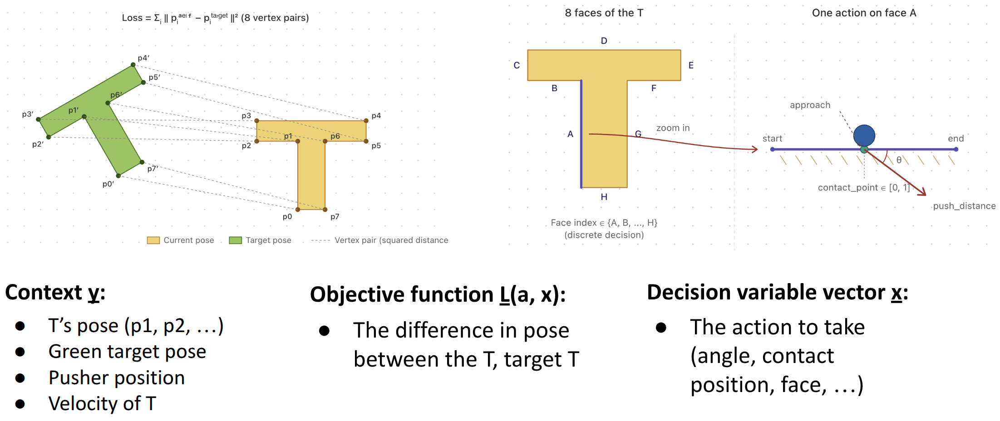
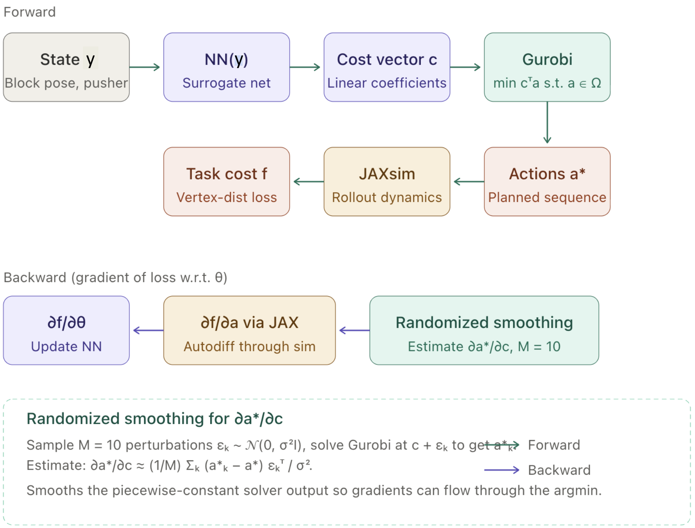
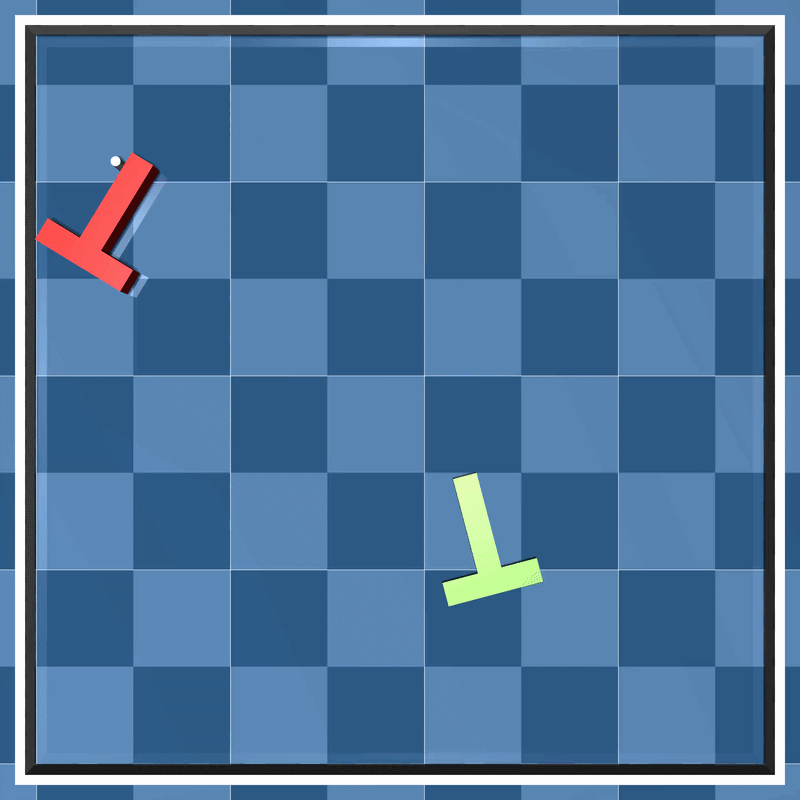
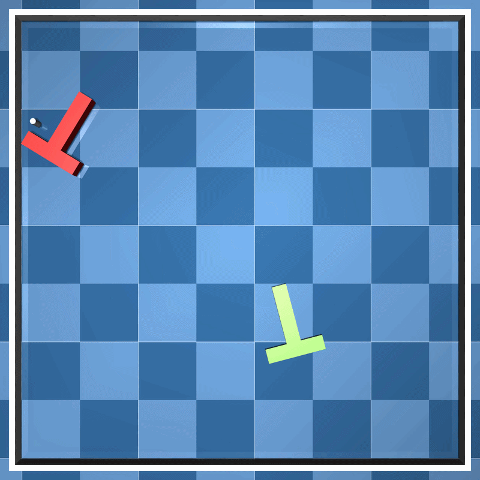

# PushT with Differentiable Simulation and Mixed Integer Quadratic Programming

This project solves the planar PushT manipulation problem using a hybrid optimization pipeline. A neural network predicts the parameters for a mixed integer quadratic program which is solved by Gurobi. The solution to the MIQP is interpreted as the push action (face, contact-point, angle). Jaxsim then rolls these actions out to get a loss value, namely the difference in pose between the target T and the T. The gradient is then backpropped through to the action via jaxsim's native differentiability. To complete the gradient graph, randomized smoothing is used to estimate the gradient of the MIQP parameters produced by the NN. This method is an implementation of [SurCo](https://arxiv.org/pdf/2210.12547). There are two problem varieties: single-step and multi-step pushing. You can also get the (nearly) optimal action for single-step and multi-step single and fixed T poses to compare against the learned policy.


**Probelm Summary**


**System Diagram**


**Single-push learned policy**


**Multi-push learned policy**



This is my final project for CSCI 619 (Spring 2026).


**T block:**
```
# Dimensions:

<-     20cm    ->
_________________
|                |   ^ 5 cm   ^ 25cm
|____       _____|   |        |
     |     |    ^             |
     |     |    | 15 cm       |
     |     |    |             |
     |_____|    |             |
     < 5cm >

+z height is 5cm


# Links
# - all p_i are on the xy plane (i.e. floor level)

p3 _____________ p4
|                 |
p2 _ p1     p6 _ p5
     |     |
     |     |
     |     |
     p0___ p7


# Faces
# - A: 0, B: 1, C: 2, D: 3, E: 4, F: 5
 
   _______ C ______
B |                | D
  |____       _____|
       |     |
       |     |
     A |     | E
       |_ F _|


# Action representation
# - face: int in {0, 1, 2, 3, 4, 5}
# - contact_point: float in [0, 1]
# - angle: float in [0, pi]
# XX - push_distance: float in [0, 0.1] XX <- CURRENTLY DISABLED!!! Push distances makes things more complicated, compared to a uniform number of sim steps.
# --
# - The push direction is _into_ the block. 
# - A contact point of 0 means the initial contact point is on the left edge of the block, 1 means it is on the right edge.
# - An angle of 0 means the push is parallel the face, pointing to the right of the face. Angle of pi means push parallel to the left of the face. pi/2 means pushing perpendicular to the face.
# - A push distance of 0 means no push, 0.1 means pushing for 10cm

       |   ^
       |  /
       | /
       |/
     A |
       |

    ^ face: A=0
      contact_point = 0.5
      angle = 3*pi/2
      XX push_distance = 0.1 XX


# Reference frame:
# - centered at the midway point of the T 
# - origin-x is +10cm from the left edge
# - origin-y is +12.5cm from the bottom edge
# - origin-z is on the floor level

_________________
|                |
|____       _____|
    |      |
       +y
       ^
       |--> +x

    |_____|


# World coordinate system:

  |
  |
  |
  | Height: 1.5m
  |
  +y
  ^
  |--> +x _________________
  <-    Width: 1.5m      ->
```

Note that urdfs can be easily visualized using the [URDF Visualizer](https://marketplace.cursorapi.com/items/?itemName=morningfrog.urdf-visualizer) VSCode extension.

## Installation

Create and activate the conda environment, then install the package in editable mode.

```bash
conda create -n pusht619 python=3.10
conda activate pusht619
pip install -e ".[dev]"

# AND:
pip install jax[cuda12] # if you have a nvidia card
```


## Usage

* NOTE: If using claude code, make sure to enter into the conda environment first.

```
# Random t-pose
python scripts/main_surco.py --n-envs 25 --random-t-pose --verbosity 1 --record-video
python scripts/main_surco.py --n-envs 1 --random-t-pose --verbosity 1 --record-video --multi-step-n-actions 2

# Fixed t-pose
python scripts/main_surco.py --n-envs 1 --verbosity 2 --record-video
python scripts/main_surco.py --n-envs 1 --verbosity 1 --record-video --multi-step-n-actions 2 --disable-random
```
